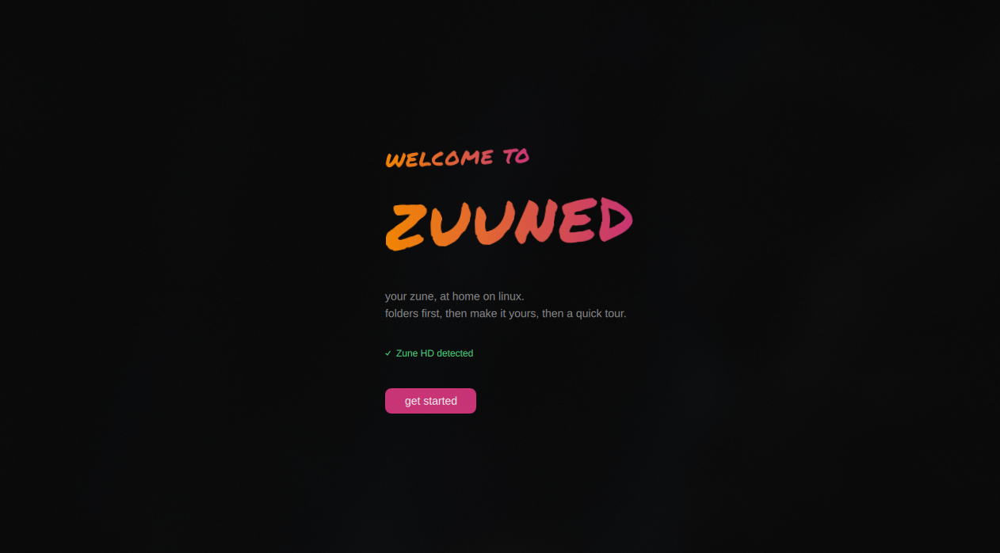
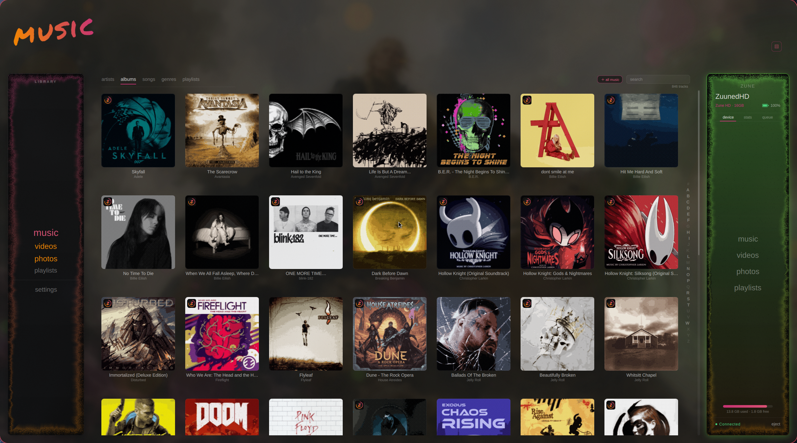
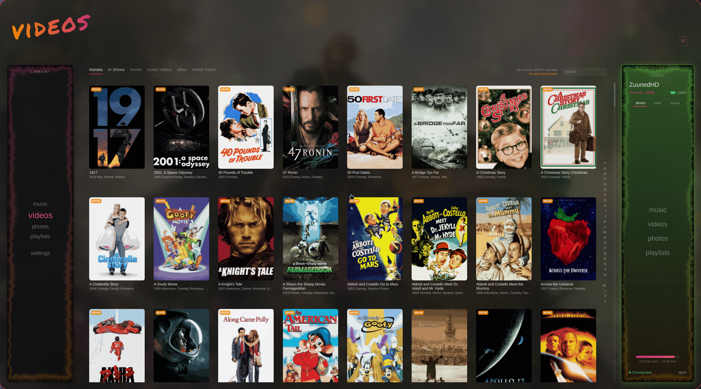
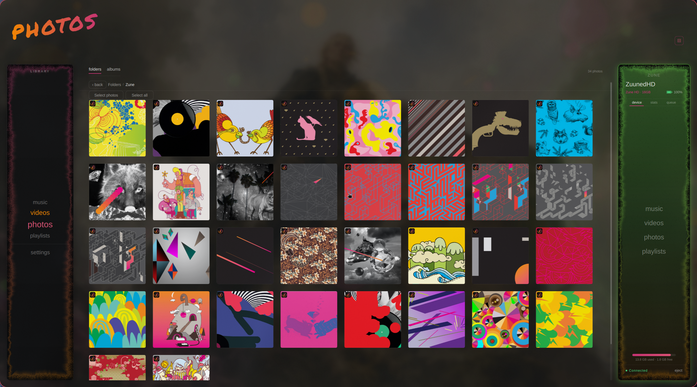
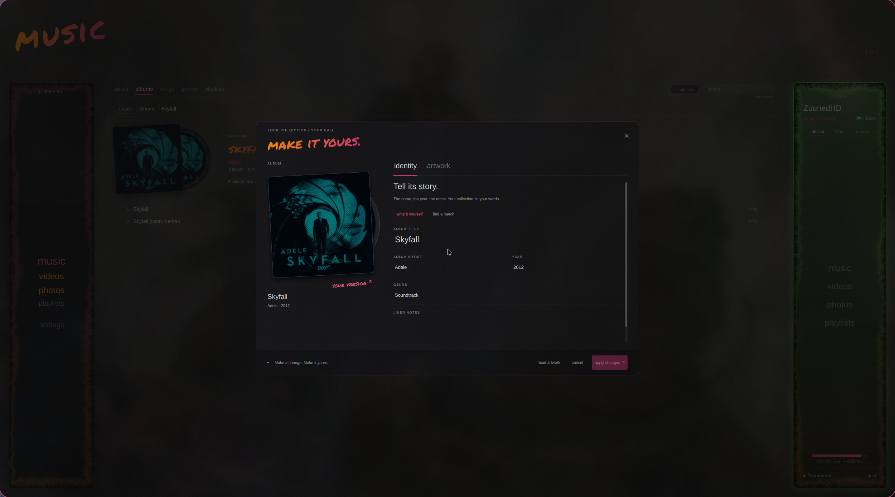

> **Public source snapshot:** read [PUBLIC_SOURCE.md](PUBLIC_SOURCE.md) for credential requirements and differences from private builds.

# Zuuned Linux

**Bring your Zune back into the rebellion.**



Zuuned is a native Linux app for managing Microsoft Zune players and enjoying
your local media collection. Browse music, movies and photos, build playlists,
customize artwork and metadata, and transfer media to your Zune over USB.



## What you can do

- **Manage your Zune:** browse its library, queue media for transfer and see
  connection and storage information.
- **Enjoy your music:** browse artists and albums, play locally, and create
  playlists and mixtapes.
- **Organize videos:** browse movies, TV shows and anime with poster artwork,
  play local videos and convert supported media for transfer.
- **Make it yours:** edit local metadata and artwork, and choose your preferred
  appearance.
- **Organize photos:** browse folders and create custom albums with nested
  subalbums.

Local playback, customization and photo organization work without a connected
Zune. Device transfers require one. No Windows virtual machine or custom kernel
driver is required; first-time USB permission setup may need an administrator
password.

## A look inside

### Your video library



### Your photos



### Your collection, your call



These are captures of the running Linux app. The collection artwork and
wallpaper shown belong to the example library and are not supplied media.

## Download and report issues

Application source and Linux releases live together at
[badgeromen/zuuned-linux](https://github.com/badgeromen/zuuned-linux).
**[Download Zuuned Linux 0.1.1](https://github.com/badgeromen/zuuned-linux/releases/tag/v0.1.1)**
for Linux x86_64 with glibc 2.41 or newer, X11/XWayland and OpenGL. Choose the
AppImage and its matching checksum. [Older releases](https://github.com/badgeromen/zuuned-linux/releases)
remain available. Source archives are for building, not ready-to-run installers.
Use each release's checksum and compatibility notes. A migrated download keeps
its original version and binary contents; it does not automatically include
changes in the current source tree.

Follow the [tester guide](packaging/TESTER_README.md) for launch and USB setup.
For a problem, open **Settings → Health → export debug report**, review the saved
text and attach it to an [issue](https://github.com/badgeromen/zuuned-linux/issues).
Include the build version, Linux distribution/desktop, Zune model and reproduction
steps. Reports never upload automatically. If startup fails, see the tester guide
for terminal capture and logs under `~/.local/state/Zuuned/Zuuned/logs/`.

## Project status

Zuuned is a native Qt 6 / QML and C++ application with local music/video playback,
artwork discovery, customization and USB media management. Its protocol library
is [libzune](https://github.com/badgeromen/libzune), a native C PTP/MTP/MTPZ stack.
No Windows virtual machine or custom Linux kernel driver is required.

This is an early testing project. Software regression coverage and historical
hardware results do not certify every new package or device combination. See
[release verification gates](docs/TESTER_RELEASE.md) for the remaining checks
and the [documentation index](docs/README.md) for current guides versus historical
test records.

## Build

Compiling the public source for Zune device support? Follow
[Building with Zune authentication](docs/BUILD_WITH_MTPZ.md) to obtain the MTPZ
data file and populate `libzune/src/mtpz_keys.h` before building. Official
downloads already include authentication.

For the native build and the existing maintainer AppImage workflow, see
[BUILDING.md](BUILDING.md). The public snapshot vendors libzune; the AppImage
snapshot exporter still requires the private development submodule layout.
The commands below are the short path
for running a development build on the current machine.

Qt **6.8 or newer** is required. Qt 6.11.2 is the current tested development
version; 6.8 is the API floor, not a claim that every older distro has passed.
The Linux player requires OpenGL. The tester AppImage targets x86_64 desktops
using X11 or XWayland; its release notes specify the tested distro/glibc floor.

Arch dependencies:

```bash
sudo pacman -S --needed base-devel git cmake ninja pkgconf \
  qt6-base qt6-declarative qt6-5compat libusb libgcrypt sqlite mpv ffmpeg lame
```

Debian 13/Trixie is the proposed clean-build baseline (verification status is in
the release gates). Development and runtime QML packages are separate:

```bash
sudo apt install build-essential git cmake ninja-build pkg-config \
  qt6-base-dev qt6-declarative-dev qt6-5compat-dev libqt6opengl6-dev \
  qt6-xdgdesktopportal-platformtheme \
  qml6-module-qtqml qml6-module-qtqml-models qml6-module-qtqml-workerscript \
  qml6-module-qtquick qml6-module-qtquick-window qml6-module-qtquick-layouts \
  qml6-module-qtquick-controls qml6-module-qtquick-templates \
  qml6-module-qtquick-dialogs qml6-module-qt5compat-graphicaleffects \
  libusb-1.0-0-dev libgcrypt20-dev libsqlite3-dev libmpv-dev \
  libavcodec-dev libavformat-dev libavutil-dev libswscale-dev \
  libswresample-dev libmp3lame-dev ffmpeg
```

Ubuntu LTS releases with older system Qt need a newer Qt toolchain; the commands
above are not an Ubuntu 22.04/24.04 compatibility promise. Configuration checks
the QML imports too, so missing GraphicalEffects fails before the first launch.

File and folder selection uses the desktop's file chooser and theme through
`xdg-desktop-portal`. The desktop session must provide the portal service and a
FileChooser backend (such as its GTK or KDE backend). The AppImage bundles the
matching Qt portal plugin; it does not bundle or replace the desktop's chooser.

```bash
git clone https://github.com/badgeromen/zuuned-linux.git
cd zuuned-linux
cmake -B build -G Ninja -DCMAKE_BUILD_TYPE=Release
cmake --build build
./build/zuuned
```


## For testers

1. Follow [tester install instructions](packaging/TESTER_INSTALL.md) for the
   versioned AppImage and checksum. The old 0.1.1 executable predates this public
   source snapshot. The Arch `packaging/PKGBUILD` requires a repository-layout
   update before it can be used with this public tree.
2. Install the USB rule below once, then replug. The app also offers a
   self-contained installer; it does not require a source checkout.
3. Pick your music/video/photo folders in onboarding. TMDB/Fanart have bundled
   fallback keys; optional personal keys in Settings override them. Provider
   outages do not block local playback or manual identity/artwork edits.
4. Connect the Zune, queue a small fixture, then sync. Media dragging and new
   transfer-queue additions require connection; local playback, metadata and
   playlist editing work offline. The saved transfer queue survives disconnects.

Report the AppImage filename/SHA256, Zune model and reproduction steps. Attach
a reviewed **Settings → Health → export debug report** file for build/system
details and recent local logs; see [diagnostics](docs/DIAGNOSTICS.md).
If interrupted during transfer, let the next-start recovery warning
identify a possibly incomplete object; do not play that object before cleanup.

## Device access (one-time setup)

```bash
sudo install -m 644 packaging/68-zuuned.rules /etc/udev/rules.d/68-zuuned.rules
sudo install -m 644 packaging/68-zuuned.rules /etc/udev/rules.d/72-zuuned.rules
sudo udevadm control --reload-rules
# replug the Zune
```

This uses systemd-udev and an active desktop session. Two ordered copies of one
canonical rule suppress libmtp probing at `68-`, reapply MTP/gphoto exclusions at
`72-`, and tag access before systemd's `73-seat-late` grant. Existing
`45-zune.rules`/`99-zune.rules` do not replace this updated pair.

## Layout

```
src/          C++; DeviceService (libzune bridge), app entry
qml/          UI; Theme.qml design tokens (ported from the macOS app)
libzune/      included source; shared C protocol library
packaging/    USB rule, Arch PKGBUILD, AppImage builder and inventory gate
```

## Testing without the app

libzune ships its own CLI harness; see `libzune/README.md`:

```bash
cd libzune && make zunetool
./zunetool info      # breach + device info
./zunetool torture <file>  # wire-protocol stress test
```

## License

Original Zuuned application code is licensed under **GPL-3.0-or-later**.
See [LICENSE](LICENSE) and [licensing scope](COPYING.md). Third-party components
retain their own licenses and attribution. Binary releases must include the
applicable notices and directions to their matching source. Linux source and
releases share this repository; libzune has its own repository.

Zuuned is an independent community project, not affiliated with or endorsed by
Microsoft. Zune is a trademark of Microsoft Corporation.
