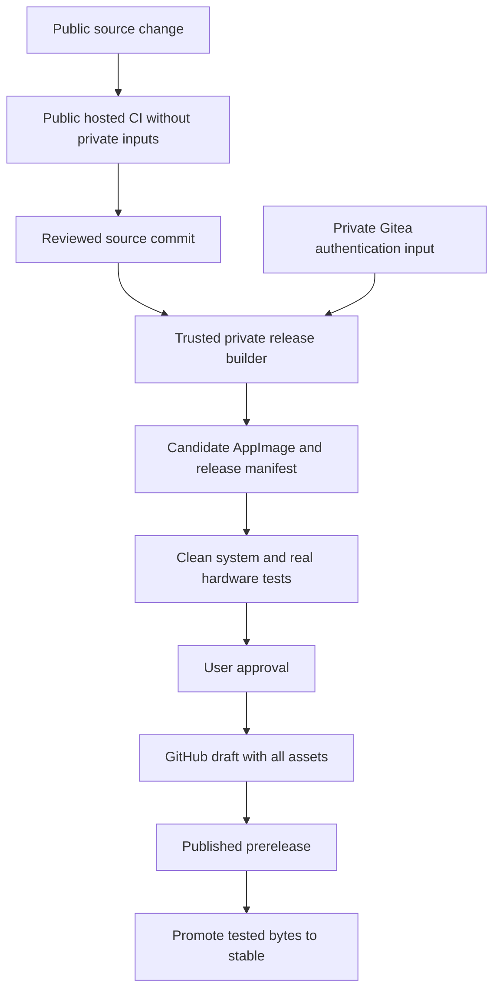

# Zuuned source, build and release architecture

Status: proposal updated October 4, 2026. No infrastructure has been provisioned and no
publication is authorized by this document. Preserve the current working app.

## Recommendation

Use GitHub for public source review and downloads, and Gitea for private build
inputs and trusted release automation. Keep packaging logic in versioned scripts
that also run locally. CI should call those scripts, not contain a second build
implementation. Start with the existing Linux AppImage pipeline.

| Location | Responsibility |
| --- | --- |
| `badgeromen/zuuned-linux` | Linux source, tests, packaging, downloads, screenshots, release notes and user reports. |
| `badgeromen/libzune` | Shared protocol source with fresh credential-free history, pinned by exact commit in each app. Coordinate with the Mac consumer before changing its pin. |
| Private Gitea release repository | Trusted orchestration, private authentication input references and confidential build records. No public PR execution. |
| Future platform source repositories | Native platform code and packaging, each following the same release contract. Create only when needed. |

The initial prepared Linux export includes libzune as ordinary source. That is
a bootstrap snapshot, not the proposed permanent shared-library arrangement.
Establish one canonical source history per component after migration. Recommend
GitHub for public application/protocol development, with Gitea backups and private
release inputs. Do not maintain independently edited public and private copies
of the same app. Never mirror the existing credential-bearing private history.
Keep that history archived privately and use the reviewed clean export to start.

## Build and publication flow

Public CI runs `ci/check.sh` and credential-free compilation on disposable hosted
runners. It never gets the MTPZ input, signing keys, publishing token or USB access.
GitHub warns that untrusted pull requests can compromise self-hosted runners.
Use a separate trusted release runner, preferably a disposable VM per job, with
restricted network access. A container sharing a privileged Docker socket is not
a sufficient boundary from the developer workstation or private infrastructure.
See [GitHub's runner security guidance](https://docs.github.com/en/actions/reference/security/secure-use).

Initially invoke releases manually with an explicit source commit. Later use
Gitea Actions to call the same scripts. Gitea describes Actions as mostly compatible
with GitHub Actions, not identical; verify behavior against the installed server
and runner versions. See [Gitea Actions](https://docs.gitea.com/usage/actions/overview/).

The private build checks out the reviewed public commit and pinned libzune revision.
It receives only the private inputs needed for that job. Never build public PR
heads with them. Never put private headers in shared caches, source archives,
debug bundles or logs. A separate publication job gets only verified artifacts
and narrow GitHub publishing access, not the authentication input.

Use a GitHub App installed only on the application repository, with the permissions
needed to publish releases. Its installation token can be restricted to specified
repositories. Keep its signing key in the private automation secret store.
See [GitHub App authentication](https://docs.github.com/en/apps/creating-github-apps/authenticating-with-a-github-app/authenticating-as-a-github-app-installation).

## Release contract

Every candidate records platform, architecture, version, application source SHA,
libzune SHA, builder image digest, packaging revision, artifact names and SHA-256,
source location, license inventory and software/hardware test evidence. Record
authentication mode publicly; keep confidential input identifiers in private
records. Do not call a build reproducible until independent rebuilds demonstrate it.

Build once, test that exact file, then publish it. Signing and platform processing
must finish before the final checksum and final artifact tests. A changed binary
requires a new candidate and renewed validation. Keep debug symbols and detailed
test evidence separately from user downloads. Source access remains clearly linked.

Use per-platform tags such as `linux-v0.1.2`, with title `Zuuned Linux 0.1.2`.
Keep existing `v0.1.0` and `v0.1.1` unchanged. Future Mac and Windows versions can
ship independently. The Linux README links Linux releases. Future platforms can use their own
source/release repositories without requiring synchronized versions.

Recommend immutable releases: upload every asset to a draft before publishing.
GitHub then locks the assets and tag, while allowing release notes and prerelease
status to change. This supports promoting tested bytes to stable. Its release
attestation establishes the release tag and asset relationship; our manifest additionally identifies libzune and build inputs.
See [immutable releases](https://docs.github.com/en/code-security/concepts/supply-chain-security/immutable-releases).

Rollback means pointing users to the previous retained release, not replacing a
published file. Database upgrades need separate backup and compatibility checks;
an older executable is not automatically safe against a newer database.

## Authentication and source boundary

Keep the user-approved TMDB/Fanart API defaults. They are distinct from the private
Zune MTPZ certificate/key material. This plan does not change provider matching or
the current device protocol.

Excluding MTPZ data from public source does not make it secret in an executable
that embeds it. User decision, October 3: distributed application builds include
the existing MTPZ material so download users need no separate authentication file.
Keep the populated header in private Gitea and supply it to trusted release builds;
exclude its values from public source. Preserve the external credential override.
The prepared public export can build without the header and supports the existing
external credential loader. Do not switch downloadable releases to user-supplied
authentication as a side effect of preparing public source.

The user has selected this distribution model. GPL corresponding-source and
third-party redistribution questions remain documented as unresolved; this decision
is not a legal finding. A sanitized source
snapshot alone is not proof that the exact distributed build's obligations are
satisfied. Keep accurate source links and all applicable licenses; do not describe
this new snapshot as the source of older binaries. See the existing license review
and [GNU's license FAQ](https://www.gnu.org/licenses/gpl-faq.en.html).

## Phased implementation and completion gates

1. **Establish the source boundary.** Review the clean Linux export, retain approved
   provider defaults, compile without the private header, test private fallback,
   and choose canonical repositories. Prepare fresh histories and migration notes.
   Gate: credential checks pass, source builds, and user approves each push.
2. **Automate public checks.** Call existing tests from hosted CI, pin external
   actions and dependencies, and protect the main branch. Keep network-provider
   integration tests separate from deterministic regression tests.
   Gate: a representative public PR passes with no private access.
3. **Automate the Linux candidate.** Reuse `packaging/containers/` and the AppImage
   workflow with explicit revisions and builder digests. Define supported systems.
   The present Debian 13 builder is not evidence of older-distribution support.
   AppImage recommends building against an adequately old baseline and testing
   each supported base system. See [AppImage guidance](https://docs.appimage.org/reference/best-practices.html).
   Gate: fresh-profile and upgrade tests, native portal selection, playback,
   diagnostics, artwork/import checks, plus real Zune transfer/readback/eject on
   supported hardware. Software tests cannot certify USB behavior.
4. **Publish a reviewed tester release.** Assemble notes, checksums, notices,
   source links and manifest before asking for approval. Download the published
   artifact and verify its checksum. Retain the previous release and test records.
   Gate: testers can install, launch, export logs and identify their exact build.
5. **Add platforms independently.** Add native build/test workers as platforms
   become ready. For macOS plan Developer ID signing and notarization, then test
   the resulting download. See [Apple distribution guidance](https://developer.apple.com/documentation/technologyoverviews/distribution).
   Windows needs its own application/device compatibility and installer validation;
   packaging alone does not establish a Windows port. Research its signing and
   installer choice when that work starts. Gate: platform-specific installation,
   upgrade, playback and hardware evidence using the same manifest contract.

## Operations and future flexibility

Keep build scripts portable and CI files thin so either CI host can be replaced.
Use explicit per-platform release configuration instead of copying whole workflows.
Start with a manually approved release command; automatic updates and package-store
distribution can follow a proven release process.

Back up Gitea repositories, database, configuration and required private inputs to
an independent encrypted destination. Exercise restore before relying on it.
Retain published artifacts, manifests and source archives independently of CI job
retention. Hosting source elsewhere is not a backup of issues, secrets or releases.

Open decisions before implementation: supported Linux baseline and available
private runner host. Public repository names are now confirmed. Defaults above are proposals, not changes already applied.
