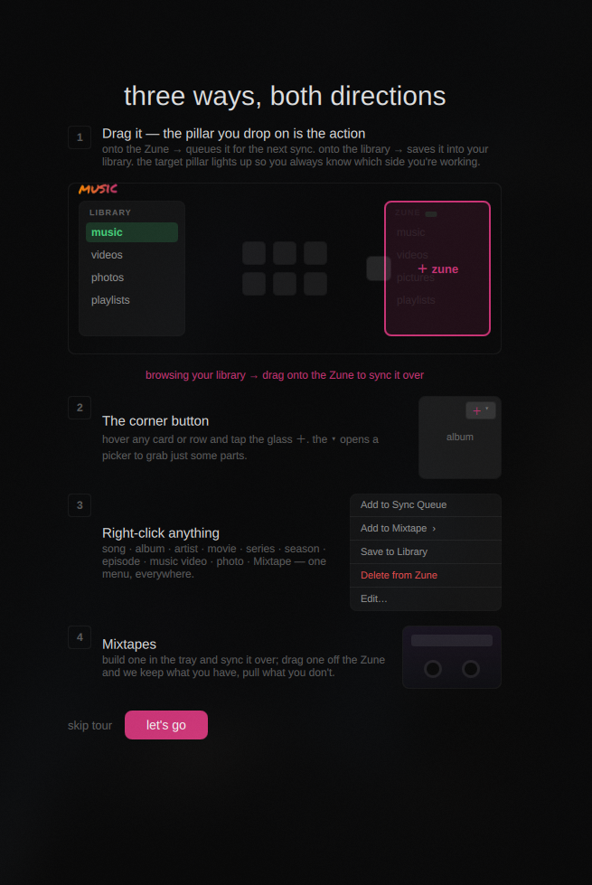

# Zuuned Linux

**Bring your Zune back into your daily rotation.**

Zuuned is a native Linux app for managing Microsoft Zune players and enjoying
your local media collection. Browse music, movies and photos, build playlists,
customize artwork and metadata, and transfer media to your Zune over USB.

## What you can do

- **Manage your Zune:** browse its library, queue media for transfer and see
  connection and storage information.
- **Enjoy your music:** browse artists and albums, play locally, and create
  playlists and mixtapes.
- **Organize videos:** browse movies, TV shows and anime with poster artwork,
  play local videos and convert supported media for transfer.
- **Make it yours:** edit local metadata and artwork, and choose your preferred
  appearance.
- **Organize photos:** browse folders and create custom albums with nested
  subalbums.

Local playback, customization and photo organization work without a connected
Zune. Device transfers require one. No Windows virtual machine or custom kernel
driver is required; first-time USB permission setup may need an administrator
password.

## A look inside

### Your video library

### Your photos

### Your collection, your call

These are captures of the running Linux app. The collection artwork and
wallpaper shown belong to the example library and are not supplied media.

## Download

Open [Releases](https://github.com/badgeromen/zuuned-linux/releases) and choose the
testing release you were invited to use. Download its AppImage, matching
SHA256 checksum, and `TESTER-README.md`. The release notes identify the supported
Linux environment, build version and known limitations.

Download the **`.AppImage`** to run Zuuned. GitHub's automatic “Source code”
archives contain source for compiling, not a ready-to-run installer. Follow the attached tester guide to verify the checksum, make the
AppImage executable, launch it and connect your Zune.

The current build targets **x86_64 Linux with glibc 2.41 or newer**, X11/XWayland
and working OpenGL. This is an early testing release; older distributions and
all device/desktop combinations are not certified. Start with a small library
and short transfers, and never interrupt an active send.

## Getting started

The built-in tour explains the everyday actions: drag media onto the Zune
panel to queue it for transfer, use a card's plus button, or right-click for
more choices. Dragging supported device items onto the library saves them
locally. Mixtapes have their own builder and can be transferred to the player.

## Report a problem

In Zuuned, open **Settings → Health → export debug report**. Save the `.txt`,
select **open report**, and review it before sharing. Attach it to an
[issue](https://github.com/badgeromen/zuuned-linux/issues/new/choose) or send it through
your existing private testing channel.

Include the release/build version, Linux distribution and desktop, Zune model,
steps to reproduce, expected and actual behavior, and approximate time/time zone.
Add a screenshot for display problems. Reports are never uploaded automatically.
Media names and paths may remain in logs; public issues have public attachments.

If the app cannot open, capture its terminal output as described in the tester
guide. Previous session logs are normally in
`~/.local/state/Zuuned/Zuuned/logs/`.

## Licenses and source access

Original Zuuned application code is licensed under GPL-3.0-or-later. Third-party
components retain their own licenses. Each published release must provide its
applicable license notices and directions
to the matching source material required by its bundled components. Hosting the
application downloads here does not change those components' license terms.

Zuuned is an independent community project, not affiliated with or endorsed by
Microsoft. Zune is a trademark of Microsoft Corporation.
